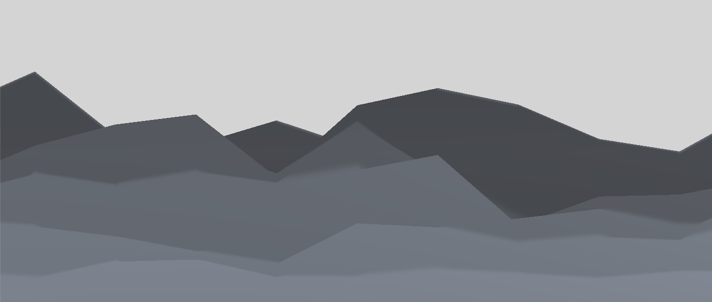

# Background Terrain

A noise-based shader for background terrain.

Best used for terrain seen in the distance, to add some more detail to the scene.

## How does it work?

The higher the Y coordinate of the texcoord, the higher the Y offset. So vertices in the back are taller.

I color it using a ramp texture multiplied by a color.

# Requires

    - Ramp Color Texture
    - Noise Texture

# Example

